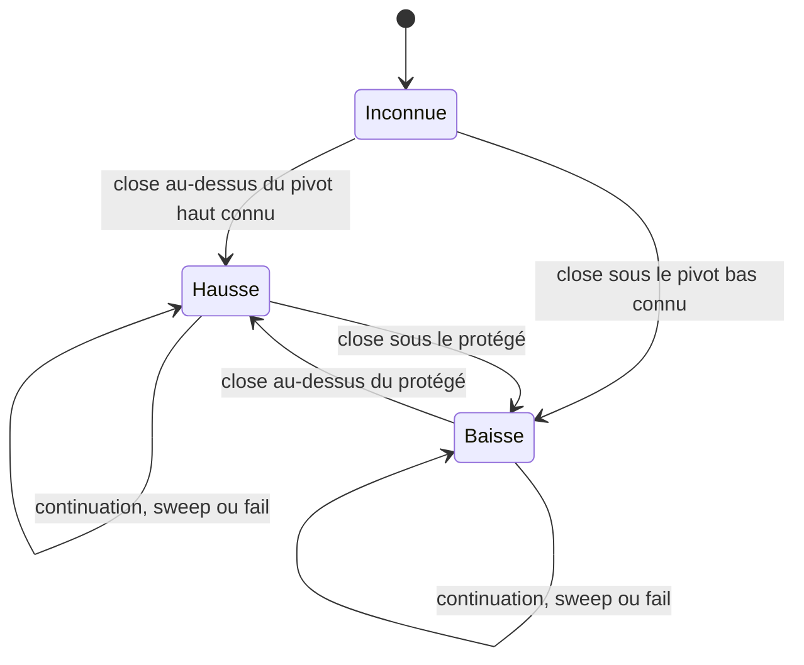
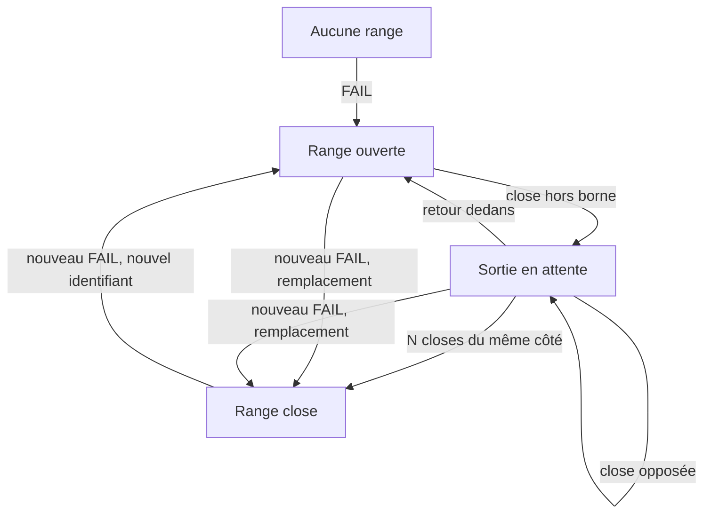
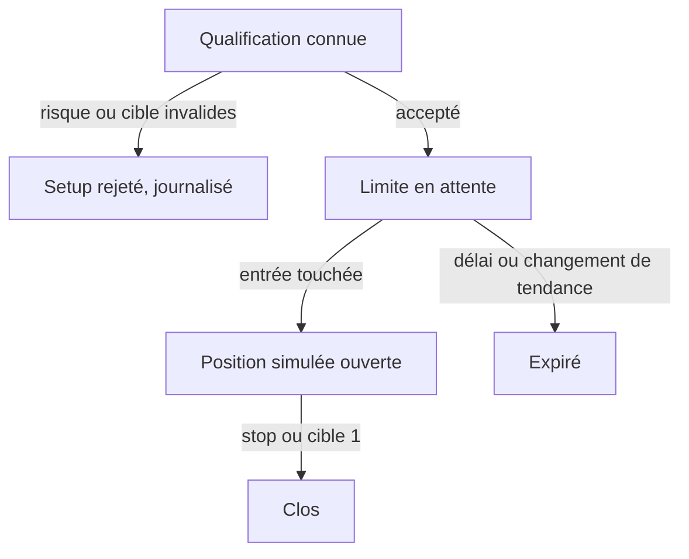

# Revue de stratégie et traçabilité indépendante

Date : 1 octobre 2026. Lire avec `GPT_AUDIT.md`, qui documente les défauts et corrections.

## Ce qui peut être reconstruit

Je ne peux pas reconstruire indépendamment la formation originale à partir de cette archive : les sources A sont absentes. La reconstruction demandée avant lecture de l’implémentation a donc abouti à un constat de non-détermination, consigné dans `audit_evidence/SOURCE_GATE.md`. Une recherche SMC externe ne devient pas une source SMV.

Le modèle ci-dessous décrit les assertions de la spécification dérivée B et le comportement C. Les statuts « explicite », « ambigu », « contradictoire » dans B sont conservés comme **statuts revendiqués par B**, sans les attribuer à la formation. Pour chaque règle, **A → B et A → C sont non vérifiables**. Aucun passage cité M1/… ou M9/… n’a été authentifié contre une transcription originale.

Mon constat indépendant est que C constitue un modèle opérationnel de structure, zones et liquidité auquel s’ajoutent des heuristiques d’entrée. Il ne couvre pas toutes les conditions que B attribue au formateur. Un gain ou une absence de gain en backtest ne tranche pas cette question de fidélité.

## Registre Source → Règle → Code

« Corrigé » concerne Python et les tests exécutés ; les ports MQL5 restent à valider. Les sources M… désignent uniquement les références **annoncées dans B**. NV signifie non vérifiable.

| Règle / concept | Référence annoncée et statut de B | Formalisation / comportement C | B → C et réserve | A → B / A → C |
| --- | --- | --- | --- | --- |
| R-ST-01, tendance | M1 ; principe explicite, support proposé | État UP/DOWN après cassure ; range séparée ; `structure.py`, `ranges.py` | Ce n’est pas un détecteur autonome de toute latéralisation | NV / NV |
| R-ST-02, swing haut/bas | M1/1 ; ambigu | Pivot strict à gauche, large à droite ; `pivots.py::update` | Conforme à la proposition ; swing discrétionnaire non reproduit | NV / NV |
| Égalités, plateaux | Proposition de B | Première occurrence, retard `pivot_right` | Plateaux et outside bar double pivot testés ; pas définition universelle de Williams | NV / NV |
| R-ST-03, HH/HL/LH/LL | M9/2, M1/10 ; explicite revendiqué | Comparaison au pivot précédent du même côté, mèches comprises | Cohérent et causal à confirmation | NV / NV |
| R-ST-04, structure majeure A/B | M1/5–6 versus M5/5–6 ; contradictoire revendiqué | A déplace le protégé à l’origine ; B le conserve ; `StructureTracker` | Les deux modèles existent ; aucune donnée ne permet d’authentifier la contradiction de la formation | NV / NV |
| Référence de continuation | Proposition de B | Pivot confirmé égal à l’extrême de jambe | Dépend de N et du délai ; affirmation d’indépendance réfutée F23 | NV / NV |
| R-ST-05, BOS par clôture | M1/10 ; explicite revendiqué | Close strict au-delà + eps ; mèche = sweep | Tests de stricte égalité et wick pertinents ; F04 simultané corrigé | NV / NV |
| R-ST-06, BOS de changement | M1/9–10 | Cassure du protégé contre la tendance ; origine extrême opposé | Conforme au modèle choisi ; niveau protégé lui-même proposé | NV / NV |
| R-ST-06, BOS de continuation | Référence fixée de B | Cassure dans le sens du trend ; retracement devient protégé A ou IDM B | Conforme aux règles A/B écrites, pas preuve de choix SMV | NV / NV |
| R-ST-07, fail | M4/3–4, M1/2 ; explicite revendiqué | Premier LH en UP, HL en DOWN, confirmé et éligible dans la jambe | Reçu incohérent avec son étiquette ; F05 corrigé | NV / NV |
| R-ST-08, 80/20 | M1/1,3,7 ; qualitatif | Aucun calcul de ratio 80/20 ni probabilité | Ne pas transformer la phrase en statistique de réussite | NV / NV |
| R-ST-09, rotation | M1/11–12, M8/3–4 ; ambigu | Pas de marqueur dans le moteur ; `rotation_legs` inutilisé | Q-08 plus affirmatif que le code ; non algorithmisé | NV / NV |
| R-ST-10, fractalité | Principe transversal | Même moteur applicable à plusieurs UT | Réutilisation d’un algorithme ne démontre pas l’équivalence des lectures | NV / NV |
| R-CA-01, BM | M2 ; bougie pleine, seuil ajouté | Couleur opposée, corps/range ≥0,7, taille ATR optionnelle | Seuil et percentile ne prouvent pas une manipulation ni l’intention du formateur | NV / NV |
| R-CA-02/03, BQA et adjacence | M2 ; source revendiquée | BQA = origine du BOS ; recherche BM sur BQA puis précédente | Heuristique mesurable ; origine discrétionnaire non vérifiée | NV / NV |
| R-CA-04, doji signature | M2 ; statut qualitatif | Corps ≤0,1 range ; fenêtre récente configurable | Seuil et fenêtre sont propositions ; bougie sans range admise comme doji | NV / NV |
| R-CA-05, signature liquidité | M2 ; grande mèche non chiffrée | Wick derrière le corps ≥0,5 range, niveau connu à clôture | N’évalue pas les ordres réellement présents dans le marché | NV / NV |
| R-OD-01, zones OB/POI | M2/M3 ; origine et bornes proposées | Proximal corps BM, distal BQA ; fallback bougie entière ; `zones.py::build` | Cohérent avec B formel ; choix des bornes pas universel | NV / NV |
| R-OD-02, décisionnelle | M3 ; plusieurs interprétations | `decisional=True` seulement sur BOS_CHANGE | Proxy local ; ni contexte HTF ni dernière offre pertinente démontrés | NV / NV |
| R-OD-03, mitigation/invalidation | M3 ; ambigu | Contact par épisode, rupture par close du distal | Conforme à la proposition ; contact et invalidation sont deux conventions distinctes | NV / NV |
| R-OD-04, ODF | M3 ; principe, chaîne proposée | BQA récupère zone précédente de même sens, longueur de chaîne | Teste un lien de prix, pas un carnet d’ordres ; causal à confirmation | NV / NV |
| R-OD-05, breaker | M3/5–6 ; zéro-réaction ambigu | Toute zone rompue donne candidat inversé ; contact + close confirme réaction | Zéro-réaction et BOS ultérieur non requis ; `BREAKER` est un candidat, malgré son nom | NV / NV |
| R-CE-01, cause/range | M4 ; critère ambigu | FAIL ouvre fourchette climax/AR ; sortie après 3 closes hors borne | Support proposé ; range peut être remplacée avant sortie ; F06/F14 corrigés | NV / NV |
| R-CE-02, cause complète | M4/3–4, M7/2 ; ordre flexible revendiqué | Sweep de borne OU fail pris, plus intention BOS ; drapeau complete | Conjonction flexible dans cette couche ; pas filtre nécessaire de tout setup | NV / NV |
| R-CE-03, effet | M4/4 ; qualitatif | RANGE_EXIT donne durée et type ; pas de cible prédite | L’amplitude d’effet après sortie n’a pas de suivi dédié ni de fin formalisée | NV / NV |
| R-LQ-01, niveaux intacts | M4/M5 | Pivot confirmé/signature → intact → clean wick ou BOS close, statut terminal | Cohérent ; une equality exacte ne prend pas le niveau | NV / NV |
| R-LQ-02, cibles | M4/M5 | Niveaux intacts au-delà de l’entrée, triés en prix | T1 seulement exécutée ; T2/T3 journalisées ; pas gestion de partiels | NV / NV |
| R-LQ-03, EQH/EQL | Tolérance ajoutée | Pivot intact de même côté, tolérance 0,1 ATR, âge maximal 500 | F12 corrigé ; nouveau sommet légèrement supérieur peut déjà avoir pris l’ancien, donc pas d’EQ intact | NV / NV |
| R-LQ-04, trendline | Déclarée subjective | Absente | Pas de seuil ou sélection inventés | NV / NV |
| R-LQ-05, inducement | M5, M9 ; interprétation A/B | Pivot du retracement révélé au BOS ; `structure.py` | Un pivot non encore confirmé au BOS ne peut pas être connu ; contexte consommé par setups | NV / NV |
| R-OU-01, heures | M6/11 ; heures Paris revendiquées | Marqueurs ; défaut measured Tokyo/Londres/New York ; repo alternatif | Valeurs measured changent le choix de calendrier ; F03 corrigé ; ni exclusion d’autres heures ni preuve de fidélité | NV / NV |
| R-OU-02, mois | Fenêtre 26–9 ; biais ambigu | Extrêmes des bougies entièrement contenues, à fin de fenêtre ; couverture explicite | F15 corrigé ; aucun biais directionnel déduit ; étude Q-09 à refaire | NV / NV |
| R-OU-03, annonces | Contexte qualitatif | Pas de calendrier économique ni filtre | Données événementielles supplémentaires requises | NV / NV |
| R-GS-01/02, Wyckoff | M7 ; lecture rétrospective revendiquée | Épisodes numérotés STB/SPRING, UA, UT/UTAD, MSO ; sortie requalifie le contexte | Candidats seulement ; phases, volume, ST et tests complets absents | NV / NV |
| R-GS-03 / R-SE-01, GOLDEN | M7/1, M9/1 ; entrée qualitative | Range ouverte/juste close, sweep opposé, zone créée par un BOS ; retour avant 10 bars | Sous-modèle ; contexte décisionnel HTF et séquence flexible non couverts | NV / NV |
| §9 / R-SE-01b, CONCEPT | M9/1 ; principe et outils opportunistes | IDM pris, continuation suivante crée zone, délai 100 bars | F07 corrigé ; sélection d’autres outils et entrée sans nouveau BOS absentes | NV / NV |
| R-SE-01c, exécution | Proposition de B | Limite au proximal, stop distal, T1 ; stop prioritaire ; pas gain sur bar déclencheur | Modèle OHLC, pas execution broker ; F13 gap de position ouverte corrigé | NV / NV |
| R-SE-02, stop et risque | Exemples M9/2, M10/1 ; plafond déduit | Risque en prix ≤2,5 ATR ; pas taille de position ni pourcentage de compte | Médiane ATR ne déduit pas un plafond enseigné ; unité pip non normalisée | NV / NV |
| R-SE-03, break-even | Préférence personnelle selon B | Absent | Ne pas généraliser une préférence en règle obligatoire | NV / NV |
| R-SE-04, raffinage | Discrétionnaire selon B | Absent ; pas recherche d’entrée sur sous-UT | Source et exemples requis pour choisir les bornes | NV / NV |
| R-MTF-01 | Bougies hautes closes | Agrégation Python UTC entière et contiguë ; HTF broker directe dans MT5 | F02/F03 corrigés ; deux sources HTF différentes ne sont pas automatiquement équivalentes | NV / NV |
| R-MTF-02 | Biais HTF | Vue datée du trend et du protégé, indépendante du moteur LTF | Aucun filtre obligatoire HTF dans `SetupTracker` | NV / NV |
| R-MTF-03, BOS trap | Intention explicite, critère proposé | Continuation LTF contraire au trend HTF restant sous son protégé | Pas de test de chevauchement avec une zone HTF ; alerte de risque heuristique | NV / NV |
| FVG / imbalance | Définition externe, optionnelle | Gap entre mèches de bougies i−2 et i ; confirmation i ; `ImbalanceScanner` | Pas de seuil de déplacement, pas de filtre central, pas utilisé pour entrer | NV / NV |
| Displacement, MSS, premium/discount | Pas de règle opérationnelle retenue | Absents ou mention non implémentée | Leur présence dans la formation n’est pas prouvable à partir de leur absence ici | NV / NV |
| Support/résistance | Pas de couche séparée | Zones/niveaux peuvent servir de repères | Ne pas les renommer automatiquement en règles SMV distinctes | NV / NV |
| Coûts, rentabilité | Hypothèses de recherche | Coût forfaitaire divisé par risque ; pas bid/ask, taille ou portefeuille | Résultats reçus obsolètes après corrections ; inférence non validée | NV / NV |

## Moments d’occurrence, d’observabilité et de confirmation

Une bougie i reçue par `Engine.on_bar` est supposée déjà close par son appelant. Le moteur ne consulte pas une horloge réelle pour attester cette précondition. En MT5, l’adaptateur exclut le bar en formation. Un ancrage ancien sur le graphique ne signifie pas que l’information était connue à cet ancrage.

| Objet / événement | Occurrence de prix ou ancrage | Première observabilité utilisée | Confirmation publiée |
| --- | --- | --- | --- |
| Pivot haut/bas | Extrême en p | Clôture p + `pivot_right` | Même clôture ; ancrage p |
| HH/LH/HL/LL | Comparaison d’extrêmes en p | Confirmation du nouveau pivot | Avec ce pivot |
| Liquidité de pivot / EQ | Extrême ancien, deuxième pivot pour EQ | Pivot confirmé / deuxième pivot confirmé | `LIQ_LEVEL` ou `EQUAL_LEVELS` à ce moment |
| Signature | Wick de la bougie i | Bougie i close | i ; niveau suivi après i |
| INIT / BOS | Close au-delà d’un niveau déjà connu | Clôture i | i, ancrage au niveau cassé |
| PROTECTED_SWEEP | Wick prend le protégé connu | Clôture i ; ordre des extrêmes inconnu | i, même si BOS de continuation simultané |
| FAIL | LH/HL en p | Confirmation du pivot | p + retard ; pas cassure requise |
| Zone BOS / IDM | Origine ou pivot du retracement dans le passé | BOS i et seulement pivots alors confirmés | i ; pas réutilisés comme signaux à l’ancrage |
| Touch / rupture / réaction | Contact ou close d’une bougie ultérieure | Clôture de cette bougie | Nouveau statut ; événement initial inchangé |
| Range | Climax/AR peuvent précéder le fail | FAIL confirmé | RANGE_OPEN à confirmation du fail |
| Wick hors borne | Dépassement dans i | Clôture i | Première clôture de l’épisode |
| Excursion en close récupérée | Première close hors borne s | Clôture de récupération r | RANGE_SWEEP à r, ancrage s |
| Range acceptée | Première close hors borne s | Nième clôture consécutive du même côté | RANGE_EXIT à s + N − 1 |
| Setup | Zone antérieure à l’entrée effective | BOS qui la crée et qualification connue | SETUP à sa création ; suivi après cette barre |
| Trigger / stop / T1 | Touches intrabar inconnues | Clôture de suivi | Confirmation à clôture, modèle de priorité explicite |
| Sessions | Début local de session | Fin de la bougie contenant le début | Marqueur à cette clôture |
| Mois | High/low des bougies retenues dans la fenêtre | Fin de fenêtre atteinte par une close | Avec `coverage=complete/partial` |
| FVG | Bougies i−2, i−1, i | Clôture de i | i, ancrage central i−1 |
| Vue HTF | Bougie supérieure | Clôture supérieure attestée | Dernier état dont UTC close ≤ instant de requête |

Les labels Wyckoff sont requalifiés via un nouvel événement de sortie. Une sortie dans le sens attendu ne valide pas rétrospectivement toutes les phases de Wyckoff ni une accumulation institutionnelle. Les ordres des événements simultanés sont déterministes dans le journal ; ils ne prétendent pas reconstituer le trajet du prix intrabar.

## Automates reconstruits depuis C

### Structure majeure

Continuation : reset de référence et de fail, nouvelle jambe ; protégé actualisé seulement en mode A. FAIL ouvre une range sans changer le trend. Le booléen `fail_done` permet un fail par jambe ; le sweep du protégé est également émis une fois avant réinitialisation. Les retours anticipés F04 et la comparaison locale F05 créaient des transitions oubliées, corrigées.

### Consolidation

Sweep de la borne opposée reste possible pendant la sortie en attente. `complete` est un drapeau indépendant, déclenché par intention et liquidité ; il ne constitue pas un nouvel état de trend. Le remplacement ferme l’ancienne instance et en ouvre une nouvelle au même instant. Une range non confirmée peut rester ouverte longtemps ; aucun timeout n’est spécifié. Les noms STB/SPRING sont des compteurs de cette machine, pas une reconnaissance complète de phases.

### Setups

Un changement de tendance n’expire que les limites non déclenchées de sens opposé. Une position simulée ouverte reste suivie par stop/T1. Le système ne passe aucun ordre, n’attribue aucune taille de compte et ne limite pas les positions simultanées. Plusieurs signaux ou trades peuvent se chevaucher. L’IDM est un contexte associé à une tendance, désormais vidé au changement ; la prise d’un IDM permet au plus une qualification CONCEPT consommée.

## Réfutations et points à ne pas décider arbitrairement

1. **La structure majeure n’est pas indépendante de N.** Sur les closes `[10,11,12,11,10,11,12.5,13,12,11.5,12,14,13.2,12.8,11,10.7,9]`, N=1 produit INIT 6, continuation 11, changement 14 ; N=4 ne produit aucun de ces événements. La macrostructure attend bien des pivots. La modifier pour réaliser une indépendance non définie inventerait une autre stratégie.
2. **Le plafond ATR ne dérive pas d’un exemple en pips.** Avec ATR=10 pips, 2,5 ATR admet 25 pips ; avec ATR=2 pips, il admet 5. Reproduire une médiane de 16,5 pips ne garantit pas les mêmes décisions que les exemples 16/20 attribués au formateur. Il manque l’unité, le contexte et la portée de la règle originale.
3. **Un percentile n’est pas une définition enseignée.** Choisir 70 % pour obtenir certaines bougies pleines, 0,1 ATR pour une proportion d’égalités ou Tokyo 10 h pour un pic de range ne prouve pas que SMV utilise ces seuils.
4. **L’ordre flexible de cause n’est pas celui de GOLDEN.** La couche cause peut constater intention puis liquidité. La création GOLDEN reste liée à un nouveau BOS après une prise. Deux modules peuvent donc être cohérents avec leurs propositions locales et manquer une même configuration décrite qualitativement.
5. **Les absences ne prouvent pas que la formation n’utilise pas un concept.** MSS, premium/discount, déplacement chiffré, raffinage et annonces ne doivent pas être reconstruits à partir des habitudes d’un autre auteur.

## Comparaison finale avec le travail préexistant attribué à Claude

Cette comparaison porte sur les fichiers reçus et leurs affirmations. Sans historique, je n’authentifie ni leur auteur exact ni ses tentatives antérieures.

| Classe demandée | Conclusion indépendante |
| --- | --- |
| Claude avait raison | Dater la confirmation distinctement de l’ancrage ; traiter les bougies closes ; séparer calcul et dessin ; tester les préfixes ; qualifier Wyckoff d’expérimental ; reconnaître l’absence de compilation MT5 ; ne pas revendiquer de rentabilité |
| Claude avait partiellement raison | Architecture causale pertinente mais agrégation et DST fuient ; journal en ajout seul dans les modules mais payload mutable ; équivalences de vocabulaire utiles mais pas universelles ; prudence OHLC utile mais −1 R ne couvre pas un gap de position ouverte |
| Claude a probablement tort | Questions Q-01 à Q-16 présentées comme tranchées par la mesure ; indépendance de N ; marqueur de rotation annoncé mais absent ; chiffres EQ et mensuels utilisés comme conclusions ; convertir des exemples de pips en règle ATR fidèle |
| Point non vérifiable | Fidélité de chaque citation de formation ; contradiction A/B attribuée au corpus ; pertinence des zones/BM/BQA ; conditions discrétionnaires exactes ; comparaison historique avec l’ancien EA ; chiffres sur données réelles non fournies |
| Problème découvert par cet audit dans la version reçue | Les 39 cas en échec du rapport de tests, dont publications HTF prématurées, fold DST, simultanéité, fail oublié, excursions opposées, IDM ancien, mutations du journal, EQ hors âge et recherches avec temporalité incorrecte |

Le statut « probablement tort » signifie réfutation d’une affirmation disponible ou extrapolation injustifiée. Il ne permet pas de conclure que la formation originale est contradictoire ou erronée. Pour lever cette réserve, la prochaine preuve utile est un corpus original relié à des exemples où plusieurs interprétations donnent des décisions différentes.
